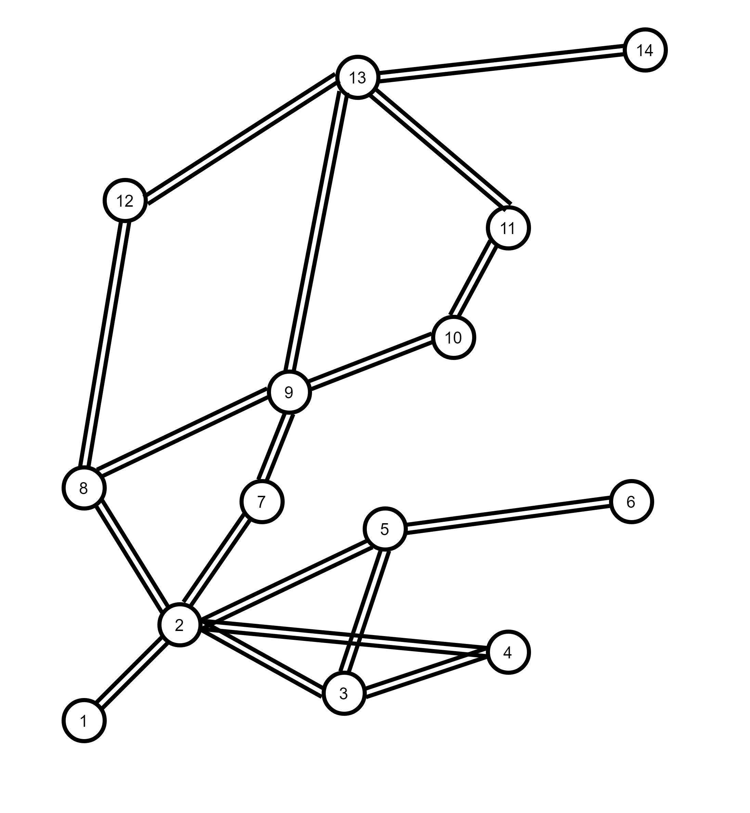
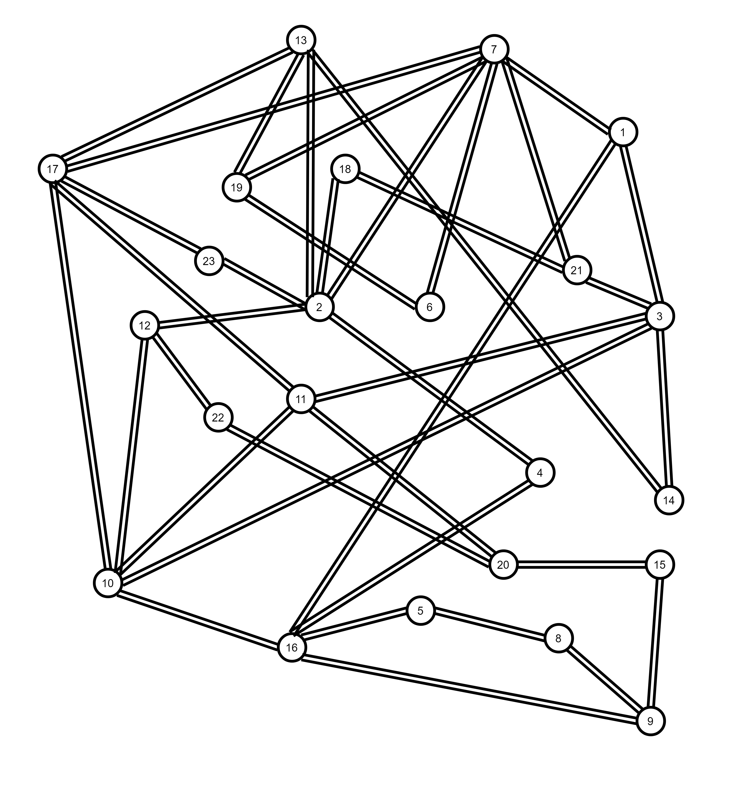

<script type="text/javascript" src="https://cdnjs.cloudflare.com/ajax/libs/mathjax/2.7.2/MathJax.js? 
config=TeX-MML-AM_CHTML"></script>

# Introduction

This project represents the work in our paper submmitted to IEEE International Conference on Communications 2021 **"An AI-based Traffic Matrix Prediction Solution for Software-Defined Network"** - Authors: **Duc-Huy LE, Hai Anh TRAN, Sami SOUIHI, Abdelhamid MELLOUK**

In this project, we provide:
- SDN application source codes
- Our Testbed configuration, deployment including scripts and used resources
- Two TM datasets
- Model training and evaluation source codes

Every above component is described in this README.

# Dependencies

## POX controller
We use [POX](https://github.com/noxrepo/pox) to deploy our management and monitoring SDN application. POX can work in any OS Environment that support python 2. You can install pox as following:

```bash
git clone http://github.com/noxrepo/pox
```

## Mininet
To simulate an SDN network, we use the popular framework [Mininet](http://mininet.org/). Mininet currenttly only works in Linux. In our project, we run mininet in an Ubuntu LTS 18.04 VM. To get mininet, you can simply download a compressed Mininet VM from [Mininet downloadpage](https://github.com/mininet/mininet/wiki/Mininet-VM-Images) or install through apt:

```bash
sudo apt update
sudo apt install mininet
```

or install natively from source:
```bash
git clone git://github.com/mininet/mininet
cd mininet
git tag  # list available versions
git checkout -b cs244-spring-2012-final  # or whatever version you wish to install
util/install.sh -a
```

## Machine Learning packages

In our project, we use [keras](https://keras.io/) and tensorflow framework to train our models, in addition, we also use several packages such as **pandas**, **numpy**, **sklearn** to preprocess data for training and **matplotlib** for result visualization. All ML source codes are written in **jupyter-notebook**. The packages can be installed by **pip** as follows:

```bash
python -m pip install -U pip
python -m pip install tensorflow, keras, numpy, pandas, scikit-learn, matplotlib, jupyter-notebook
```
## Testbed auxiliary components

In our custom testbed, to generate traffic in our simulated network, we use **tcpreplay** to emulate packets from network capture files (.pcap). Before that, we use several components(**tcprewrite**, **bittwiste**, **editcap**, **mergecap**) to modify the files so that they can fit the hosts's identity. 


# SDN Applications Usage

In this project, we created two POX applications, the source codes are stored in [pox-apps directory](https://github.com/duchuyle108/SDN-TMprediction/tree/main/pox-apps). The first component, **basic_forwarding**, installs flow rules to switches basing on the incoming packets.In our situation, we ignore the network management on network services, so a flow for IP packets simply consists of only three matching fields: protocol (IP), Source IP Address and Destination IP Address. The simplicity would reduce load on controller and help switches forward packets faster. The second also our main application, **traffic_observation**, perform our main objective, to periodically measure Traffic Matrix of the network. The method is described clearly in our paper.

To run the applications, copy two python programs into *ext* folder of POX directory and run following command:

```bash
python pox.py openflow.spanning_tree --no-flood --hold-down openflow.discovery basic_forwarding traffic_observation --output=output_path --interval=measurement_interval_in_second
```

The traffic_observation has two options:
- **output**: The path relative path of the file you want to store measured Traffic Matricies. By default, no data is saved, the matricies are only displayed in the CLI window.
- **interval**: the time in second between two consecutive TM measurement. The default value is 60.

Note that, in our project, we do not focus on routing strategy, which does not affect TM measurement result. Hence, we use two provided components from POX: openflow.spanning_tree and openflow.discovery to monitor network topology and block some ports on switches to prevent loops in our network.

# Custom Testbed Deployment
In our project, we build an SDN network testbed using Mininet simulator to evaluate our SDN TM measurement application and provide a second dataset for prediction task.
## Network topology
We use the BSO Network 2011 topology obtained from [Topology Zoo](http://www.topology-zoo.org/dataset.html). The network consists of 14 nodes and 18 links, as described below:

<p align="center">

</p>

In our Mininet simulation, each node is represented by a ovs-switch. each switch is connected to a host, which generates traffic flows in the network. 

## Traffic Generation

To perform the most realistic network environment. At first, we gather network capture files (.pcap) in real network from several sources (real-time captured in our network or public pcap library like [Netresec](https://www.netresec.com/)). The pcaps also varies from many type of services such as file transfer, video stream, DNS, web surfing or even intrusion traffic. Most of the pcap files contain packets from many connections, therefor we have to filter out traffic flows from the connections we want by using WireShark. After that, we modify the end points of them so they would fit the addresses of the hosts in our network. Traffic preparation is an important part, defines the operation of the network. 

In our project, for each node, we prepare a pcap file for traffic to every other node. After the modification, we propose two approaches to retransmit them using tcpreplay:

- (1): For each host, transmit all of its pcap files using multiple parallel tcpreplay processes.
- (2): Merge all of the pcap files into a single file and use one only process to replay it.

The first approach is less complex in configuration. However, it takes more resources to run. And in large-size network with a big number of nodes, two many tcpreplay processes could use up the VM's resource and affect the Testbed's stability. So we propose the second approach, to merge all of a node's pcap files into a single one using [mergecap](https://linux.die.net/man/1/mergecap). Though, this encouters a problem that the absolute timestamp of the pcap files are different, so the traffic to other nodes might not be transmitted simultaneously. So we have to change their timestamps first by using [bittwiste](http://bittwist.sourceforge.net/). For each approach, we create two traffic preparation scripts: *Testbed/modify-pcap.sh* and *Testbed/merge-pcap.sh* corresponding to the first and second approach.

*Testbed/prepare-pcaps* directory contains the prepared pcap files using approach (1). 

## Deployment
To deploy our Testbed simulation, run the following command:

```sh
sudo python Testbed/mininet/bso-topo.py
```

Note that, in the program, we run a CLI script when finishing create network topology, to automatically run tcpreplay command in every hosts. Script file *traffic_gen_script1.sh* corresponds to approach (1) in traffic generation and the other, *traffic_gen_script2.sh* for aproach (2).

## Collected dataset

Running the Mininet simulation with POX applications proposed above, we collected a dataset containing 6257 traffic matricies after running for 4 days, stored in *dataset/testbed_flat_tms.csv* 

# GÉANT Backbone Network data

GÉANT Backbone Network dataset is the most well-known Traffic Matrix dataset. You can download the raw data [here](http://totem.info.ucl.ac.be/dataset.html). GÉANT Backbone Network topology consists of 23 nodes and 38 links, as described below:

<p align="center">

</p>

The dataset contains Traffic Matricies from a 4-month period capturing with 15-minute invterval. Originally, each traffic matrix is stored in a single xml file. For more convinence in using the dataset, we make a script (*dataset/geant-dataset-converter.py*) to convert all of the separate matricies into a single file. *dataset/geant_flat_tms.csv* is the final converted dataset. The dataset consists of 10772 traffic matricies.

# Traffic Matrix Prediction

## Machine Learning models

In our project, to deal with the time series prediction problem, we propose three popular RNN variants: Long Short-Term Memory (LSTM), Bidirectional LSTM (BiLSTM) and Gated Recurrent Unit (GRU). Each of the models has one hidden layer with 100 units. They are all trained through 200 epochs and the best parameter set is kept for further evaluation.

## Data preparation
Firstly, to normalize the data, we divide all of the traffic volume by the biggest one so that every value is in range (0, 1). From the raw matricies, we form a time series dataset by group 11 consecutive matricies as a record (10 first matricies is the input and the last one is the ouput of the record). Secondly, we divide the dataset into two subset: 80% used for training and 20% used for evaluation. 

## Methodology

In this work, we assume that each Original-Destinaion (OD) traffic is independent from other ones. SO that we feed the models with one OD traffic at a time.

The training processes are operated using tensorflow and keras framework. 

## Evaluation
We use RMSE formula to evaluate the prediction generated by trained models, defined as follow:

$$ RMSE = \sqrt{(\frac{1}{n})\sum_{i=1}^{n}(y_i - x_i)^2 } $$

The lower RMSE value, the better overall prediction performance.

# Acknowledment

This research is funded by Vietnam National Foundation for Science and Technology Development (NAFOSTED).
